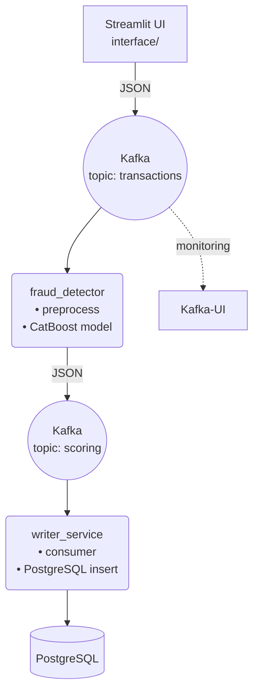

# Real‑Time Fraud Detection System

Система показывает, как организовать потоковый скоринг транзакций на лету:

* Kafka‑битва принимает события о транзакциях.
* ML‑сервис (CatBoost) вычисляет вероятность мошенничества.
* Writer складывает результаты в PostgreSQL.
* Streamlit‑интерфейс позволяет «пощёлкать» системой руками.
* Kafka‑UI даёт наблюдать сообщения в топиках.

---

## Архитектура



| Компонент       | Роль                               | Порт (host) |
|-----------------|------------------------------------|-------------|
| **interface**   | Streamlit UI — имитация потока CSV | 8501 |
| **fraud_detector** | ML-сервис (CatBoost + preprocess) | — |
| **writer**      | Запись скорингов в Postgres        | — |
| **postgres**    | Хранилище результатов              | 5432 |
| **kafka / zookeeper** | Брокер сообщений              | 9092 / 2181 |
| **kafka-setup** | Cоздание топиков (*1 раз*)         | — |
| **kafka-ui**    | Веб-обзор Kafka                    | 8080 |

* **interface/** Streamlit‑приложение, эмулирует поток транзакций (порт **8501**).
* **fraud\_detector/** ML‑сервис: kafka‑consumer → `preprocess.py` → CatBoost → kafka‑producer.
* **writer\_service/** Слушает топик `scoring`, пишет JSON в таблицу `scores`.
* **kafka‑setup** Одноразовый скрипт: создаёт топики `transactions` и `scoring`.
* **kafka‑ui** Веб‑морда брокера (порт **8080**).
---

## 📂 Структура репозитория

```
.
├── interface/
│   └── app.py                # Streamlit UI
├── fraud_detector/
│   ├── app/                  # main.py + utils
│   ├── src/
│   │   ├── preprocessing.py  # feature engineering
│   │   └── scorer.py         # CatBoost wrapper
│   ├── models/
│   │   └── my_catboost.cbm   # >100 MB, хранится через Git LFS
│   └── Dockerfile
├── writer_service/
│   ├── src/writer.py
│   └── Dockerfile
├── postgres/
│   └── init.sql              # схема таблицы scores
├── tests/
│   ├── __init__.py
│   └── test_preprocessing.py # pytest для CI
├── docker-compose.yml
├── requirements.txt          # для локального запуска
└── README.md                 # этот файл
```

---

## 🚀 Быстрый старт

### 1. Предусловия

* **Docker ≥ 20.10** и **Docker Compose v2**
* (опц.) **Git LFS** — если модель > 100 MB

  ```bash
  git lfs install
  ```

### 2. Клонирование + модель

```bash
git clone https://github.com/<ВАШ_НИК>/fraud-detection-system.git
cd fraud-detection-system
git lfs pull   # скачает *.cbm
```

### 3. Запуск всего стека

```bash
docker compose up --build -d
```

Через 1‑2 минуты сервисы будут готовы.

| URL                                            | Назначение                                                           |
| ---------------------------------------------- | -------------------------------------------------------------------- |
| [http://localhost:8501](http://localhost:8501) | Streamlit UI (отправка CSV)                                          |
| [http://localhost:8080](http://localhost:8080) | Kafka‑UI                                                             |
| PostgreSQL                                     | `localhost:5432`, база `transactions`, user/pass `postgres/postgres` |

### 4. Проверка руками

```bash
# продюсер: отправим одну транзакцию
printf '123:{"transaction_time":"2025-06-17T10:30:00","amount":99.9}' | \
  docker compose exec -T kafka \
  kafka-console-producer --bootstrap-server kafka:9092 \
  --topic transactions --property parse.key=true --property key.separator=:

# консумер: убеждаемся, что скоринг долетел
docker compose exec kafka \
  kafka-console-consumer --bootstrap-server kafka:9092 \
  --topic scoring --from-beginning \
  --property print.key=true --property key.separator=:
```

Если в ответ прилетает JSON с `score` и `fraud_flag` — всё работает.

---

## 🧪 Тесты

```bash
pip install -r requirements.txt
pytest tests/
```

Тесты проверяют, что `preprocess()` корректно извлекает фичи и не падает на пустых полях.
